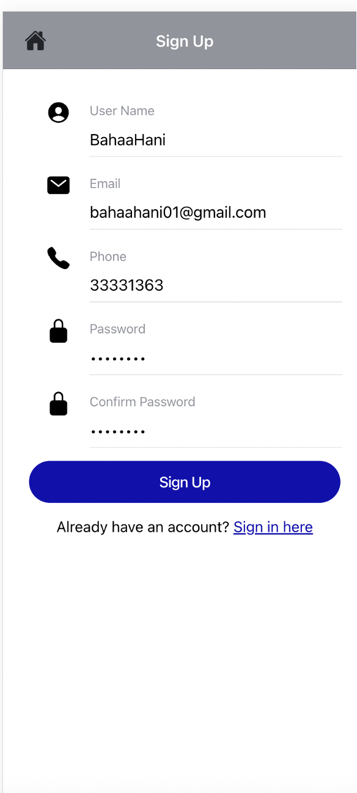
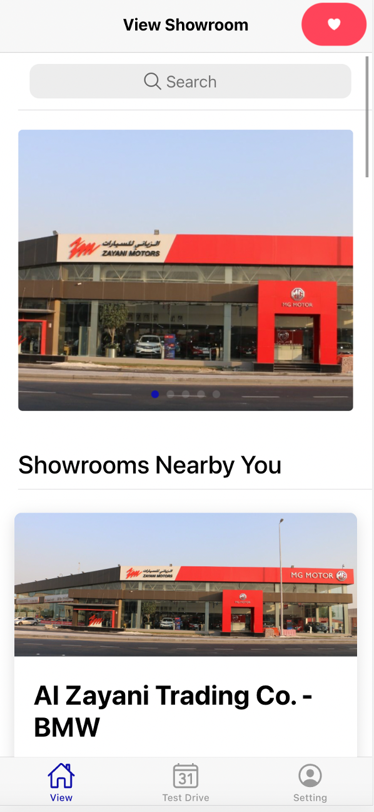
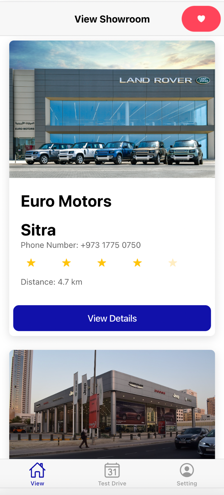
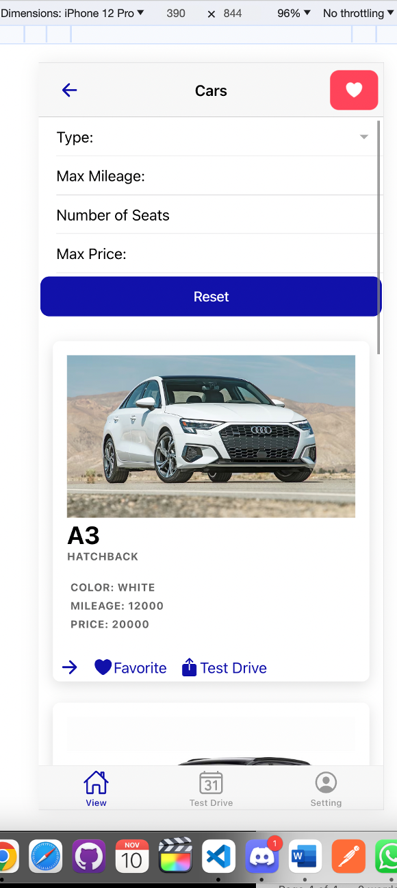
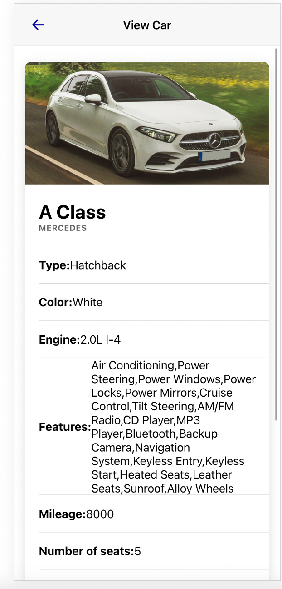
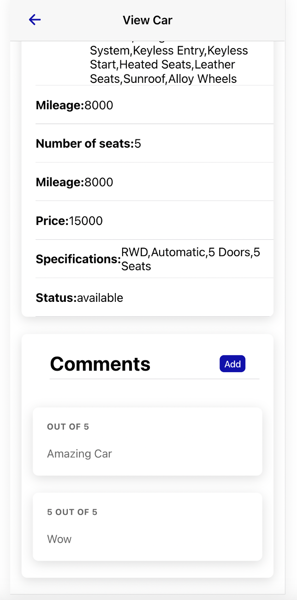
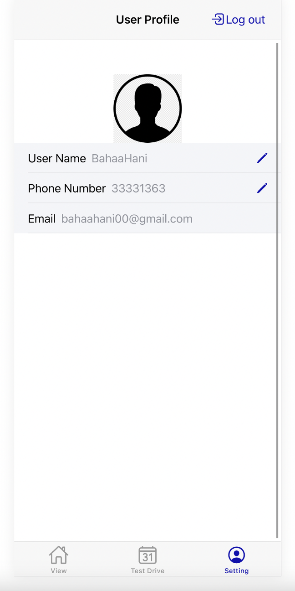
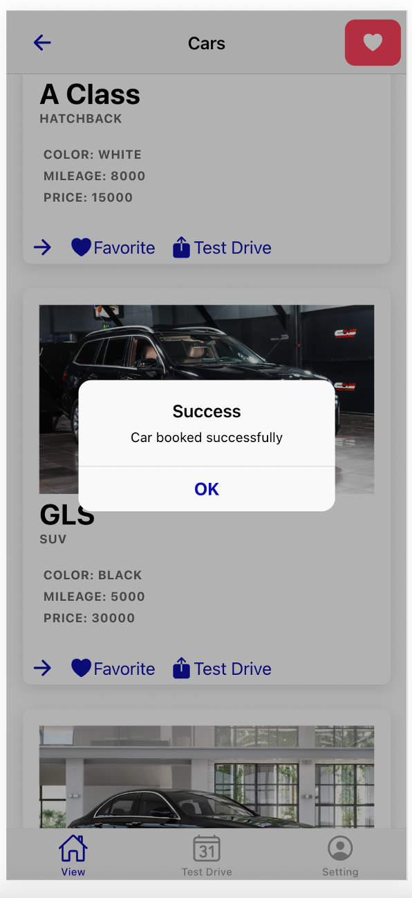

# Welcome to the Car Rental System Project

Welcome to our GitHub page for the Car Rental System! This project is an innovative solution for managing car rentals, built using Ionic/Angular. We're excited to share our work with you.

## Explore Our Project

### [Setup Instructions](https://github.com/bahaahani/Car-Rental-System/blob/main/SETUP.md)
Get started with our project by following these detailed setup instructions.

### [Version Control and Bug Tracking](https://github.com/bahaahani/Car-Rental-System/blob/main/VERSION_CONTROL.md)
Learn about how we use GitHub for version control and tracking bugs.

### [Hosting Information](https://github.com/bahaahani/Car-Rental-System/blob/main/HOSTING.md)
Find out how our project is hosted and managed on GitHub.

### [Code of Conduct](https://github.com/bahaahani/Car-Rental-System/blob/main/Code_of_Conduct.md)
Our principles and standards for contributing.

### [Communication Channels](https://github.com/bahaahani/Car-Rental-System/blob/main/Communication_Channels.md)
Information about our communication platforms and protocols.

### [Developer Documentation](https://github.com/bahaahani/Car-Rental-System/blob/main/Developer_Documentation.md)
Detailed documentation for developers.

### [Developer Guidelines](https://github.com/bahaahani/Car-Rental-System/blob/main/Developer_Guidelines.md)
Guidelines for developers contributing to the project.

### [Features and Requirements](https://github.com/bahaahani/Car-Rental-System/blob/main/Features_Requirements.md)
The features and requirements of our project.

### [Related Projects](https://github.com/bahaahani/Car-Rental-System/blob/main/related_projects.md)
Discover related projects and initiatives.

### [License](https://github.com/bahaahani/Car-Rental-System/blob/main/LICENSE)
View the licensing terms for using and contributing to our project.

## App Screenshots

Take a look at how the Car Rental System app will look and feel:

    
    
    
    
    
    
    
    

## Contributing

We welcome contributions! If you're interested in contributing, please read our [contribution guidelines](https://github.com/bahaahani/Car-Rental-System/blob/main/CONTRIBUTING.md).

## Feedback and Support

For feedback, support, or inquiries, please open an issue in our [issue tracker](https://github.com/bahaahani/Car-Rental-System/issues).

Thank you for visiting our project, and we hope you find it helpful and inspiring!

---

Car Rental System - Driving innovation in car rental management.
